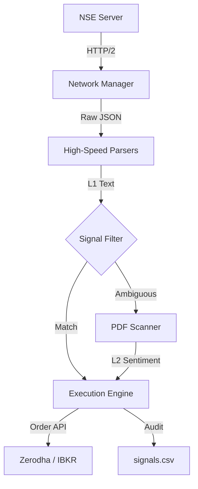

# 🦅 Garuda Quant Engine

[](https://projectgaruda.io)
[](https://projectgaruda.io)
[](https://www.nseindia.com)

> **"Speed is the only edge that compounds."**

**Garuda Quant Engine** is an institutional-grade, asynchronous event processor designed for high-frequency news arbitrage in Indian financial markets. It bypasses standard retail latency by utilizing a specialized networking stack and C-optimized parsing libraries to intercept corporate announcements seconds before they appear on visual terminals.

---

## ⚡ Core Capabilities

### 1. Ultra-Low Latency Architecture

- **Event Loop**: Powered by **`uvloop`** (MagicStack), providing 2x-4x throughput over standard asyncio.
- **Parsing**: Utilizes **`orjson`** for zero-copy JSON deserialization and **`PyMuPDF` (Fitz)** for in-memory PDF extraction.
- **Concurrency**: Asynchronous batch processing allows simultaneous scanning of multiple data streams without I/O blocking.

### 2. Advanced WAF Bypass

- **Network Stack**: Migrated from `aiohttp` to **`httpx` with HTTP/2**.
- **Fingerprinting**: Mimics exact TLS fingerprints of modern browsers (Chrome 120+) to penetrate Akamai/Cloudflare defenses (NSE 403 Forbidden).
- **Session Persistence**: Maintains persistent TCP connections and handles cookie handshakes automatically.

### 3. Signal Generation & Execution

- **L1 Filtering (Text)**: Instant regex matching on announcement strings (`~0ms`).
- **L2 Filtering (Vision)**: Deep-scan of attached PDFs for sentiment analysis using vector keywords.
- **Direct Execution**: Integrated adapters for **Zerodha Kite** and **Interactive Brokers (IBKR)** for immediate order placement upon signal confirmation.

### 4. Enterprise Grade

- **Reproducibility**: Environment locked via **Pixi** (`pixi.lock`) ensuring bit-for-bit consistency across dev and production.
- **Persistence**: Structured logging (`logs/`) and signal auditing (`signals.csv`) for post-trade analysis.

---

## 🏗 System Architecture



---

## 🚀 Quick Start

### Prerequisites

- **OS**: Linux or macOS (ARM64/x64) preferred for `uvloop` support.
- **Manager**: [Pixi](https://pixi.sh/) for hermetic dependency management.

### Installation

1.  **Clone & Install**

    ```bash
    git clone https://github.com/udapy/garuda-quant.git
    cd garuda-quant
    pixi install
    ```

2.  **Configure Credentials (Optional)**
    For live trading, export your broker keys.

    ```bash
    export ZERODHA_API_KEY="your_api_key"
    export ZERODHA_ACCESS_TOKEN="your_access_token"
    # export IBKR_PORT=7496 # If using Live TWS
    ```

3.  **Engage Systems**
    ```bash
    pixi run start
    ```
    _Select your execution mode (Zerodha, IBKR, or Paper) when prompted._

---

## 🛠 Configuration

| Setting          | File        | Description                                                       |
| :--------------- | :---------- | :---------------------------------------------------------------- |
| `POLL_INTERVAL`  | `config.py` | Frequency of API checks (Default: `0.5s`).                        |
| `KEYWORDS`       | `config.py` | Sets of positive/negative trigger words ("Bonus", "Fraud", etc.). |
| `MAX_CONCURRENT` | `config.py` | Limit on parallel PDF downloads to prevent rate-limiting.         |

---

## 📊 Output Artifacts

- **`signals.csv`**: Real-time record of all generated trade signals.
  ```csv
  timestamp,symbol,signal,reason,details
  2025-12-23T10:00:01,INFY,BUY,L1_TEXT_MATCH,"bonus issue declared"
  ```
- **`logs/`**: Detailed system diagnostics for debugging latency or network issues.

---

### ⚠️ Disclaimer

_This software is for educational and research purposes only. High-frequency polling may violate exchange Terms of Service. Use responsibly. The authors are not responsible for financial losses._

_Copyright © 2025 Garuda Quant Engine Research._
